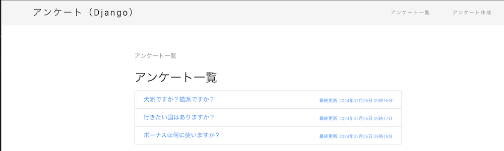

# ポートフォリオ用のDjangoで作成したアンケートWEBサイト

## 概要

Djangoで作成したアンケートWEBサイトです。

## 使用技術

- Python
- Django

## デモ

### アンケート一覧画面

## 動作確認方法

ローカル環境とDocker環境で動作確認可能です。

### Docker環境

Dockerを利用して実行する場合は、以下の手順で動作確認できます。  
Dockerがインストールされていることを前提として説明します。

1. シェルを起動します。
2. プロジェクトフォルダに移動します。
3. `docker compose up -d`を実行して、Dockerコンテナを起動します。
4. `docker compose exec django poetry run python src/manage.py makemigrations`を実行して、データベースを作成します。
5. `docker compose exec django poetry run python src/manage.py migrate`を実行して、データベース構造を作成します。
6. ブラウザで `http://localhost:8000` にアクセスして、画面を表示します。
7. 停止したい場合は、`docker compose down`を実行してください。

### ローカル環境

ローカル環境で動作確認する場合は、以下の手順で動作確認できます。  
Pythonがインストールされていることを前提として説明します。

1. コマンドプロンプトを起動します。
2. プロジェクトフォルダの`src`ディレクトリに移動します。
3. `poetry install`を実行して、パッケージをインストールします。
4. `poetry run src/manage.py makemigrations`を実行して、マイグレーションファイルを作成します。
5. `poetry run src/manage.py migrate`を実行して、データベース構造を作成します。
6. `poetry run src/manage.py runserver`を実行して、サーバーを起動します。
7. ブラウザで `http://localhost:8000` にアクセスして、アンケートを表示します。
8. 停止したい場合は、`Ctrl + C`を実行してください。
